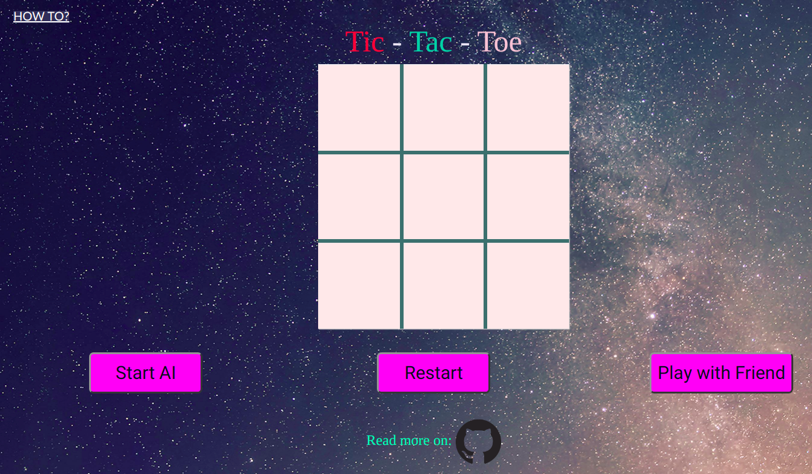

# Tic-Tac-Toe

This is an implementation of Minimax AI Algorithm with alpha-beta pruning on Tic-Tac-Toe game. Try it [here](Tic-Tac-Toe game with Minimax algorithm and alpha-beta Pruning).

<p align="center">
 </img>
</p>

## What is Minimax and alpha-beta pruning

**_Minimax_**  is a kind of backtracking algorithm that is used in decision making and game theory to find the optimal move for a player, assuming that your opponent also plays optimally. It is widely used in two player turn-based games such as Tic-Tac-Toe, Backgammon, Mancala, Chess, etc. These games are known as zero-sum games, because in a mathematical representation: one player wins (+1) and other player loses (-1) or both of anyone not to win (0).

**__Alpha-Beta pruning__** is not actually a new algorithm, rather an optimization technique for minimax algorithm. It reduces the computation time by a huge factor. This allows us to search much faster and even go into deeper levels in the game tree. It cuts off branches in the game tree which need not be searched because there already exists a better move available. It is called Alpha-Beta pruning because it passes 2 extra parameters in the minimax function, namely alpha and beta.

## How does it work

The algorithm searches recursively, the best move that leads the *Max* player to win or not lose (draw). It considers the current state of the game and the available moves at that state, then for each valid move it plays (alternating *min* and *max*) until it finds a terminal state (win, draw or lose).

## Pseudo Code

```js
function minimax(state, depth, alpha, beta, player)

 if (depth = 0 or gameover) then
		score = evaluate this state for player
		return [-1, -1, score];

 if (player = max) then
		best = [-1, -1, -Infinity]
 else
  		best = [-1, -1, +Infinity]


 for each valid move m for player in state s do
  		execute move m on s
  		[move, score] = minimax(s, depth - 1, alpha, beta, -player)
  		undo move m on s

  		if (player = max) then
   			if score > best.score then best = [move, score]
   			alpha = max(alpha,score)

  		if(player = min) then
   			if score < best.score then best = [move,score]
			   beta = min(beta,score)

		if (alpha<=beta)	break;

  return best

```  
  

## Game Tree

The game tree is clearly shown below, if it's the maximizer's turn, it would choose the path shown in the __optimal game play__ and some branches are discarded as ```alpha <= beta``` .  

<p align="center">
	</img>
</p>

<br>

## Simplified game tree

<p align="center">
	</img>
</p>

That tree has 11 nodes. The full game tree has 549.946 nodes! You can test it putting a static global variable in your program and incrementing it for each minimax function call per turn.

In a more complex game, such as chess, it's hard to search whole game tree. However, Alpha–beta Pruning is an optimization method to the minimax algorithm that allows us to disregard some branches in the search tree, because it cuts irrelevant nodes (subtrees) in search.


References:

* **Wikipedia**: <https://en.wikipedia.org/wiki/Minimax>
* **Wikipedia**: <https://en.wikipedia.org/wiki/Alpha%E2%80%93beta_pruning>
* **GeeksForGeeks**: <https://www.geeksforgeeks.org/minimax-algorithm-in-game-theory-set-4-alpha-beta-pruning/>

